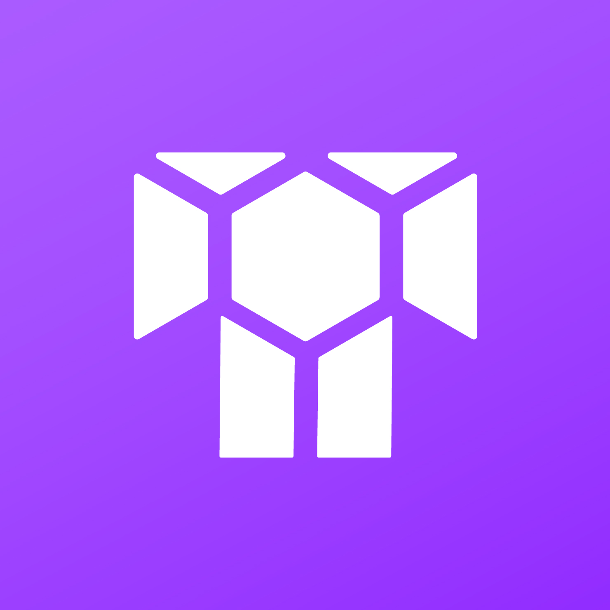

<p align="center">
  
</p>
<p align="center">
  <i align="center">Flagship UI to access Torque Protoco</i>
</p>

## Overview

Torque is a non-custodial, smart contract protocol designed to automate and simplify smart contract interaction. It unifies the transaction execution experience and streamlines access to the finest onchain opportunities while ensuring self-custody.

- **Site**: [https://torque.fi](https://torque.fi)
- **Twitter**: [https://twitter.com/torquefi](https://twitter.com/torquefi)
- **Telegram**: [https://t.me/torquefi](https://t.me/torquefi)
- **Docs**: [https://docs.torque.fi](https://docs.torque.fi)

## Features

- **Boost**: Supply assets across diversified liquidity pools, ensuring compound yield with minimized risk.
- **Borrow**: Collateralize Bitcoin, Ethereum, or other supported assets and receive an onchain loan.
- **Import**: Reduce interest burden by seamlessly transitioning into the best available rates.
- **Vote**: Participate in protocol governance with the Torque (TORQ) token by proposing and voting on upgrades.

## Getting Started

To use the interface, follow these simple steps:

1. **Connect Your Wallet**  
   Start by connecting a compatible wallet (MetaMask, WalletConnect, etc.) to access Torque's features.

2. **Choose Your Action**  
   - **Boost**: Earn yield by routing your stablecoins to multiple major pools.
   - **Borrow**: Use supported collateral assets to access onchain loans and keep your crypto working for you.
   - **Import**: Streamline loan migration from protocols such as Aave and Radiant into Compound.

3. **Monitor and Manage**  
   Use the dashboard to keep track of your yield, collateral, loan health, and portfolio performance.

## Installation

If you're a developer interested in contributing to the Torque dApp or running it locally, you can get started with the following commands:

```bash
# Clone the repository
git clone https://github.com/torquefi/torque_dapp.git

# Navigate into the directory
cd torque_dapp

# Install dependencies
yarn install

# Run the app
yarn dev
